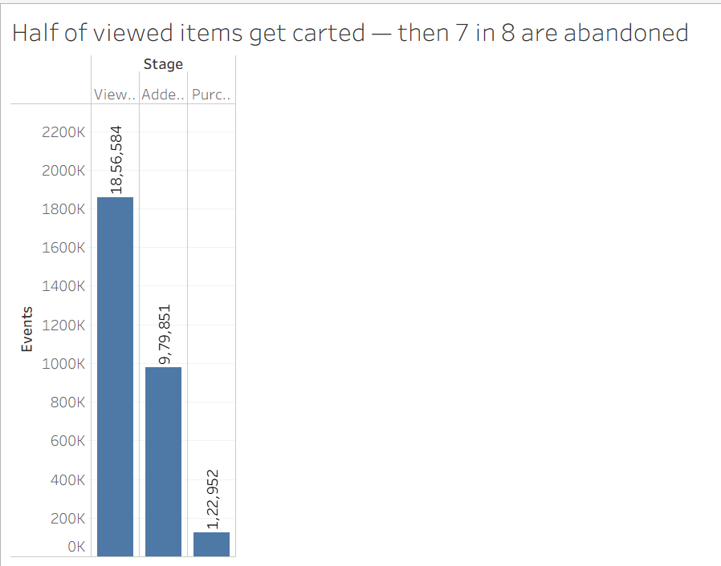
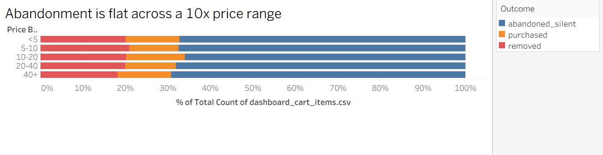
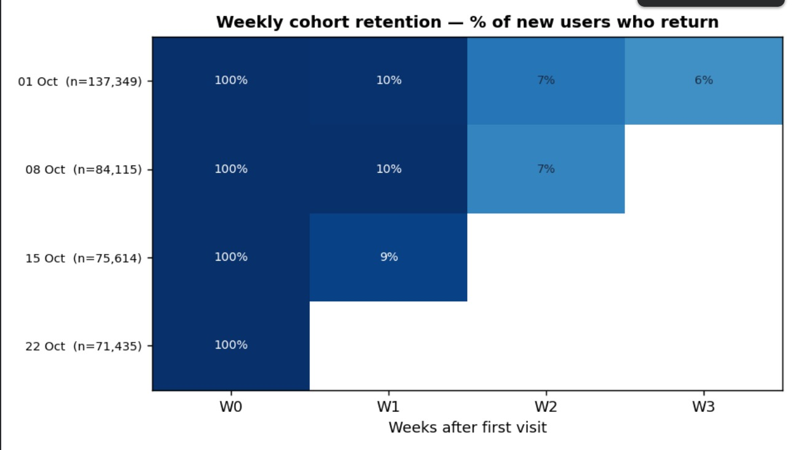
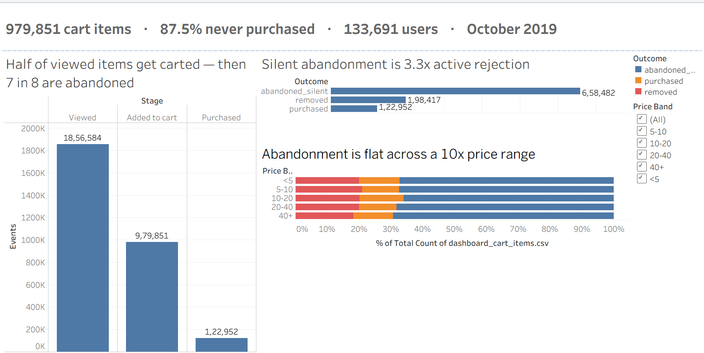

# Cart Abandonment Analysis  Online Cosmetics Retailer

Analysis of **3.9 million user events** from a real e-commerce store (REES46 cosmetics
shop, October 2019) to answer one question: *why do customers fill baskets and then
leave without buying?*

**Headline: 87.5% of items added to a cart were never purchased.**

The interesting part is *why* and the most popular explanation turned out to be wrong.

---

## The finding that changed the recommendation

Most cart abandonment analyses report a single blended rate. Splitting it in two
changes what you'd actually do about it:

| Outcome | Items | Share |
|---|---:|---:|
| **Silently abandoned** — never revisited | 658,482 | **67.2%** |
| **Removed from cart** — actively rejected | 198,417 | 20.2% |
| Purchased | 122,952 | 12.5% |

**Silent abandonment is 3.3× active rejection.** Two thirds of customers never went
back to the basket at all, they didn't reject anything, they simply left.

A discount aimed at that group is aimed at people who never looked at the price again.



---

## Testing the obvious explanation and rejecting it

The intuitive hypothesis is that expensive items get abandoned more. It doesn't hold:

| Price band | Cart items | Abandoned |
|---|---:|---:|
| under 5 | 680,316 | 87.3% |
| 5–10 | 197,031 | 88.4% |
| 10–20 | 74,992 | 86.2% |
| 20–40 | 16,860 | 88.1% |
| 40+ | 10,652 | 87.5% |

**A 2.2 point spread across a 10× price range, and not even monotonic**  the 10 to 20
band performs best. Price is not driving this behaviour, which removes discounting
from the recommendation set.



---

## Customers don't come back either

Weekly cohorts within October. **Only 9.7% of new visitors return the following
week**, near identical across all four cohorts, so this is structural, not a bad week.



This connects to the first finding: silent abandoners aren't deliberating and
returning later. **The abandoned basket and the lost customer are largely the same
event.**

---

## Dashboard

Interactive Tableau dashboard, funnel, outcome split, price-band breakdown, with a
price filter.



---

## Recommendations

1. **Basket recovery messaging** targeting the 658,482 silently abandoned items not
   the 198,417 actively removed. Different failure modes need different fixes.
2. **Persistent baskets.** With a 9.7% week one return rate, a surviving basket is the
   only remaining link to a customer who won't otherwise be seen again.
3. **Do not discount.** Abandonment is flat across a 10× price range.

**Validation:** A/B test on the silent-abandonment cohort, half receive a basket
reminder within 24 hours, measure purchase rate over 7 days, with unsubscribe rate as
a guardrail.

---

## How it was built

| Stage | |
|---|---|
| **Source** | Kaggle API → 482 MB raw CSV, 4.1M events |
| **Clean** | Removed double-fired tracking events, sessionless rows, zero prices. **94.6% retained** |
| **Model** | Flat event log → six-table star schema in SQLite |
| **Analyse** | SQL (incl. window functions) + pandas — funnel, cohorts, driver testing |
| **Present** | Tableau dashboard + 5-slide recommendation deck |

### The data model

The raw download is a single flat CSV. I normalised it into a star schema:

```
fact_events        3,882,509   every user action
fact_cart_items      979,851   one row per basket item, with its outcome
dim_session          871,605
dim_user             399,366
dim_product           41,614
dim_brand                241
```

`fact_cart_items` is the analytical core and doesn't exist in the source data. Each
row is one item someone put in a basket, tagged with what happened to it.

### Two decisions worth explaining

**Grain.** Abandonment is reported at *item* level (87.5%), not session level (81.5%).
A session that carts three items and buys one is one win and two losses; session grain
scores it a win and understates the loss by six points. Both were computed.

**Bots were flagged, not deleted.** Sessions with 100+ events and under 4s median
dwell are marked `is_bot` and filtered per query, keeping the decision reversible.

---

## Limitations

1. **One month of data.** No seasonality, no long-run retention.
2. **Weekly cohorts, not monthly.** A one month window collapses monthly cohorts to a
   single cell. Weekly gives four groups but only measures short-run return and
   beauty repurchase cycles run longer than a week. Reported as *week-1 return rate*,
   never "retention".
3. **The first cohort is contaminated.** Everyone active in week 1 counts as "new"
   because the data starts there, inflating that group.
4. **Bot detection is conservative** — 0.26% of sessions flagged, likely an undercount.
5. **`category_code` is mostly null**, so category breakdowns are unreliable. Brand is
   the usable dimension.
6. **Carting is not intent.** Some baskets were never meant to convert, so abandonment
   overstates lost sales by an unmeasurable amount.

---

## Also tested, not supported

| Hypothesis | Result | Verdict |
|---|---|---|
| Price drives abandonment | 87.3%–88.4% across bands | Rejected — 2.2 pts, non-monotonic |
| First visits convert worse | 86.5% first vs 88.3% returning | Rejected — and reversed |
| Time of day drives abandonment | 91.2% at 00:00 UTC vs 85.3% at 06:00 | Weak, and timezone-confounded |

The time-of-day result is reported in UTC while the retailer is Russian (UTC+3), so
the apparent midnight peak is 03:00 local. Not treated as a driver without correction.

---

## Repo contents

```
make_sample_data.py         synthetic fixture for dry runs
01_load_and_model.py        CSV → SQLite star schema, chunked + cleaning log
02_queries.sql              six analysis queries, incl. window functions
03_analysis.py              funnel, cohorts, driver testing, chart export
findings.md                 full written findings
cart_abandonment_deck.pptx  5-slide recommendation deck
Cart Abandonment.twb        Tableau workbook
funnel.csv                  aggregate funnel counts for the dashboard
Funnel.png / Price_Band.png / weekly_cohort.jpeg / Dashboard.png
```

Raw data and the SQLite database are gitignored — the CSV is 482 MB. Download the
dataset from Kaggle (*eCommerce Events History in Cosmetics Shop*, publisher
`mkechinov`) into `data/raw/` and run:

```bash
python 01_load_and_model.py --source raw --months 2019-Oct
python 03_analysis.py
```

---

**Tools:** Python (pandas, matplotlib) · SQL (SQLite) · Tableau Public · Google Colab
